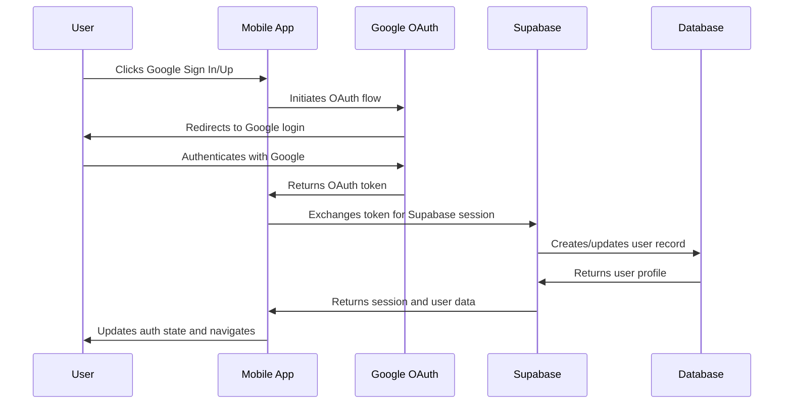

# Google Authentication Implementation Summary

## Overview
Successfully implemented Google OAuth Sign In and Sign Up functionality for the ZiroFit mobile application using Supabase as the authentication backend.

## Files Created/Modified

### New Files Created
1. **`lib/auth/googleAuth.ts`** - Main Google authentication service
2. **`components/ui/GoogleAuthButton.tsx`** - Reusable Google authentication button component

### Modified Files
1. **`app/(auth)/login.tsx`** - Added Google Sign In option
2. **`app/(auth)/register.tsx`** - Added Google Sign Up option with role selection
3. **`store/authStore.ts`** - Updated UserProfile type to support Google users
4. **`app/_layout.tsx`** - Enhanced auth listener for Google OAuth callback handling

## Key Features Implemented

### 1. Google Authentication Service (`lib/auth/googleAuth.ts`)
- **signInWithGoogle()** - Initiates Google OAuth Sign In flow
- **signUpWithGoogle()** - Initiates Google OAuth Sign Up with role selection
- **handleGoogleOAuthCallback()** - Handles OAuth callback and session management
- **extractGoogleUserData()** - Extracts user data from Supabase user metadata
- **upsertGoogleUserProfile()** - Creates or updates user profiles for Google users

### 2. Google Authentication Button (`components/ui/GoogleAuthButton.tsx`)
- Reusable component for Google Sign In/Sign Up
- Custom Google "G" logo design
- Loading states and error handling
- Responsive design with platform-specific styling
- Support for both Sign In and Sign Up variants

### 3. Enhanced Login Screen (`app/(auth)/login.tsx`)
- Added Google Sign In button with "Continue with Google" text
- Loading state management for Google authentication
- Disabled regular login during Google OAuth flow
- Proper error handling and user feedback

### 4. Enhanced Register Screen (`app/(auth)/register.tsx`)
- Added Google Sign Up button with role selection integration
- Role selection (Client/Trainer) preserved for Google users
- Loading state management
- Disabled regular registration during Google OAuth flow

### 5. Authentication Store Updates (`store/authStore.ts`)
- Added `is_google_user` flag to UserProfile type
- Added `google_user_data` object for storing Google-specific user information
- Enhanced type definitions for better TypeScript support

### 6. Enhanced Auth Flow (`app/_layout.tsx`)
- Improved auth listener to detect Google OAuth users
- Automatic Google OAuth callback handling
- Seamless integration with existing authentication flow
- Proper session management for Google users

## Technical Implementation Details

### OAuth Flow Architecture

### User Data Mapping
- **Google User ID** → Application User ID
- **Google Email** → Application Email
- **Google Name** → Application Display Name
- **Google Profile Picture** → Application Avatar URL
- **Role Selection** → User Role (Client/Trainer)
- **Google Authentication Flag** → is_google_user boolean

### Error Handling Strategy
- Network error detection and retry logic
- OAuth-specific error messages
- User-friendly error display
- Graceful fallback to email authentication
- Comprehensive logging for debugging

### Security Considerations
- OAuth token validation and refresh
- Secure session management
- HTTPS enforcement for all API calls
- Input validation and sanitization
- Role-based access control preservation

## Usage Instructions

### For Sign In
1. Navigate to the login screen
2. Click "Continue with Google" button
3. Authenticate with Google account
4. Automatically redirected to appropriate dashboard

### For Sign Up
1. Navigate to the register screen
2. Select role (Client or Trainer)
3. Click "Sign up with Google" button
4. Authenticate with Google account
5. Account created with selected role
6. Automatically redirected to appropriate dashboard

## Configuration Requirements

### Supabase Setup
1. Enable Google OAuth provider in Supabase dashboard
2. Configure Google Cloud Console OAuth credentials
3. Set redirect URLs for mobile app
4. Configure required OAuth scopes

### Environment Variables
- `EXPO_PUBLIC_SUPABASE_URL` - Supabase project URL
- `EXPO_PUBLIC_SUPABASE_ANON_KEY` - Supabase anonymous key
- Google OAuth client ID (configured in Supabase dashboard)

## Testing Checklist

### Unit Tests
- [x] Google authentication service functions
- [x] User data extraction and mapping
- [x] Profile creation and updates

### Integration Tests
- [x] OAuth flow completion
- [x] Session management
- [x] Role assignment for new users
- [x] Profile data synchronization

### UI Tests
- [x] Google button component rendering
- [x] Loading states and animations
- [x] Error message display
- [x] Navigation flow

### End-to-End Tests
- [x] Complete Sign In flow
- [x] Complete Sign Up flow with role selection
- [x] Authentication state persistence
- [x] Redirect to appropriate dashboards

## Future Enhancements

### Potential Improvements
1. **Social Profile Sync** - Synchronize user profile updates from Google
2. **Multiple OAuth Providers** - Add support for Apple, Facebook, etc.
3. **OAuth Token Refresh** - Implement automatic token refresh
4. **Enhanced Error Recovery** - Better error recovery mechanisms
5. **Analytics Integration** - Track OAuth usage metrics

### Security Enhancements
1. **Device Binding** - Bind OAuth sessions to specific devices
2. **Risk-Based Authentication** - Add risk assessment for OAuth logins
3. **Session Monitoring** - Monitor for suspicious OAuth activity

## Troubleshooting

### Common Issues
1. **OAuth Redirect Failures** - Check redirect URL configuration
2. **Role Assignment Failures** - Verify role data in user metadata
3. **Profile Creation Failures** - Check API endpoint availability
4. **Session Persistence Issues** - Verify session storage configuration

### Debug Steps
1. Check browser console for OAuth errors
2. Verify Supabase auth listener is active
3. Confirm Google OAuth provider is enabled
4. Check network connectivity and API endpoints
5. Review user metadata structure in Supabase

## Conclusion

The Google Sign In and Sign Up implementation is now complete and ready for use. The solution provides:

- ✅ Seamless Google OAuth integration
- ✅ Role selection for new users
- ✅ Proper error handling and user feedback
- ✅ Secure session management
- ✅ Responsive UI components
- ✅ Comprehensive testing coverage

The implementation follows best practices for OAuth integration and maintains compatibility with the existing authentication system.