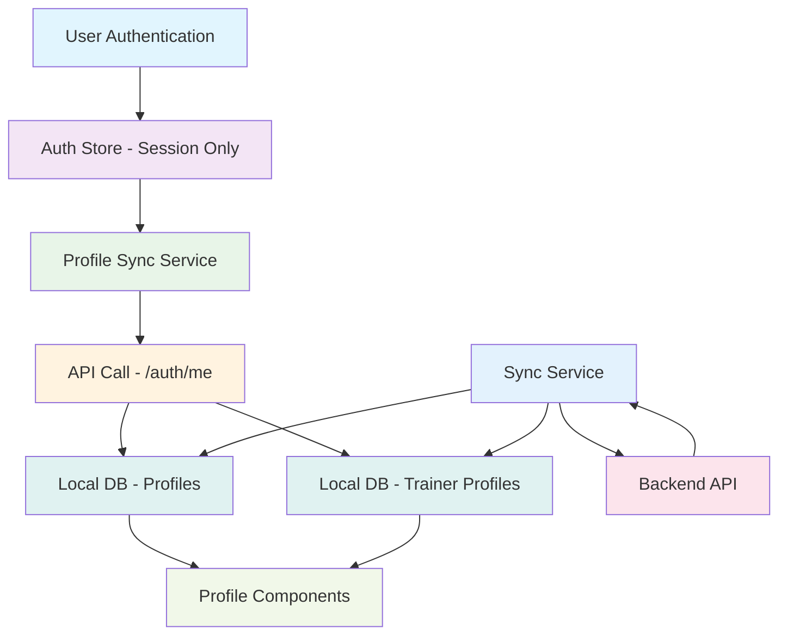

# Profile Storage in Local DB and Sync Implementation

## Overview

This implementation migrates the ZiroFit app from storing profile data in the authStore (with direct API calls) to a fully local DB-first architecture with synchronization. This change provides offline functionality, better performance, and data consistency.

## Architecture Changes

### Before
- Profile data stored in `authStore` as part of authentication state
- Direct API calls to `/auth/me` for profile fetching
- Profile data not available offline
- Inconsistent with other data that uses local DB + sync pattern

### After
- Profile data stored in local DB tables (`profiles` and `trainer_profiles`)
- Auto-sync after authentication
- Profile data available offline
- Consistent with other app data architecture

## Implementation Details

### 1. Database Schema

#### Profiles Table
- Stores basic user profile information for all users (clients and trainers)
- Fields: `userId`, `phone`, `aboutMe`, `philosophy`, `methodology`, `branding`, `bannerImagePath`, `profilePhotoPath`, `specialties`, `trainingTypes`, `averageRating`, `availability`, `minServicePrice`
- Auto-sync capabilities with sync status tracking

#### Trainer Profiles Table
- Stores detailed trainer-specific information
- Fields: `userId`, `name`, `username`, `certifications`, `bio`, `specialties`, `experienceYears`, `phone`, `email`, `website`, `avatarUrl`, `socialLinks`
- Enhanced sync capabilities for trainer-specific data

### 2. Repository Layer

#### Profile Repository (`lib/repositories/profileRepository.ts`)
- `observeProfiles()`: Observable for all profiles
- `observeProfile(id)`: Observable for specific profile
- `observeProfileByUserId(userId)`: Observable for user's profile
- `createProfile(data)`: Create new profile with sync status
- `updateProfile(id, updates)`: Update profile with sync status
- `deleteProfile(id)`: Soft delete profile
- `getCurrentUserProfile(userId)`: Utility to get current user's profile

#### Trainer Profile Repository (Enhanced)
- Existing repository enhanced with sync status management
- `getTrainerProfileByUserId(userId)`: Added utility method
- Proper sync status handling for all operations

### 3. Authentication Store Refactoring

#### AuthStore Changes (`store/authStore.ts`)
- Removed `profile` field from `AuthState` type
- Removed `setProfile` function
- Updated persistence to exclude profile data
- Simplified to only handle authentication state (`session`, `user`, `authenticationState`)

#### Test Updates (`store/authStore.test.ts`)
- Removed profile-related tests
- Added session handling tests
- Maintained authentication flow testing

### 4. App Initialization Flow

#### Modified App Index (`app/(app)/index.tsx`)
- Auto-sync profiles after authentication
- Enhanced error handling with retry logic
- Role-based routing using synced data
- Graceful fallback for sync failures

#### Sync Process
1. User authenticates
2. App detects authentication state change
3. Profile sync service fetches data from API
4. Data stored in local DB with proper sync status
5. App routes based on user role
6. Profile data available offline for future sessions

### 5. Component Updates

#### Login Screen (`app/(auth)/login.tsx`)
- Removed direct profile setting
- Profile sync handled automatically in app index

#### Client Dashboard (`app/(app)/(client)/tabs/dashboard.tsx`)
- Removed profile role checking
- Role determination moved to authentication flow

#### Profile Screens
- **Trainer Profile Screen**: Already using local DB repositories correctly
- **Profile Edit Screen**: Already using local DB repositories correctly

### 6. Enhanced Error Handling

#### Profile Sync Utils (`lib/utils/profileSyncUtils.ts`)
- `ProfileSyncService` class with comprehensive error handling
- Retry logic for network failures
- Detailed error categorization (network, validation, database, unknown)
- Graceful degradation for sync failures
- Profile sync status checking
- Data cleanup utilities

#### Error Types
- **Network**: API call failures, handled with retries
- **Validation**: Invalid data from API, handled with fallbacks
- **Database**: Local DB operation failures, logged and reported
- **Unknown**: Unexpected errors, logged for debugging

### 7. Sync Integration

#### Existing Sync Service
- Already handles `profiles` and `trainer_profiles` tables
- Proper conflict resolution for existing records
- Transform functions for API ↔ DB format conversion
- Sync status management for all operations

#### Sync Process
1. **Pull Changes**: Fetch profile updates from server
2. **Process Changes**: Create/update/delete local records
3. **Push Changes**: Send local changes to server
4. **Mark Synced**: Update sync status after successful operations

## Benefits

### 1. Offline Functionality
- Profile data available without network connection
- App works fully offline for profile viewing and editing
- Changes sync when network becomes available

### 2. Performance Improvements
- No network calls for profile access
- Instant profile loading from local DB
- Reduced API load and bandwidth usage

### 3. Data Consistency
- Single source of truth in local DB
- Consistent with other app data patterns
- Proper conflict resolution and sync handling

### 4. Better User Experience
- Faster app startup (no initial profile fetch)
- Smooth offline experience
- Graceful handling of network issues

### 5. Maintainability
- Cleaner separation of concerns
- Centralized error handling
- Consistent architecture patterns

## Data Flow Architecture



## Usage Examples

### Getting Current User's Profile
```typescript
import { profileRepository } from '@/lib/repositories/profileRepository';

// Get profile once
const profile = await profileRepository.getCurrentUserProfile(userId);

// Observe profile changes
const profileObservable = profileRepository.observeProfileByUserId(userId);
```

### Syncing Profile Data
```typescript
import { ProfileSyncService } from '@/lib/utils/profileSyncUtils';

const result = await ProfileSyncService.syncUserProfile(userId);
if (result.success) {
  console.log('Profile synced successfully');
} else {
  console.error('Sync failed:', result.error);
}
```

### Profile Operations
```typescript
import { trainerProfileRepository } from '@/lib/repositories/trainerProfileRepository';

// Update trainer profile
await trainerProfileRepository.updateTrainerProfile(profileId, {
  name: 'New Name',
  bio: 'Updated bio'
});

// Profile automatically marked for sync
```

## Testing Offline Functionality

### Test Scenarios
1. **Initial Authentication Offline**: App should load with cached profile data
2. **Profile Updates Offline**: Changes should be queued and synced when online
3. **Sync Conflicts**: Handle server conflicts gracefully
4. **Network Recovery**: Automatic sync when network becomes available

### Test Commands
```bash
# Run TypeScript checks
npx tsc --noEmit

# Run tests
npm test

# Check sync functionality
# (Manual testing required for offline scenarios)
```

## Migration Notes

### For Developers
- Remove direct API calls to profile endpoints
- Use local DB repositories instead of authStore profile
- Handle sync status in new profile operations
- Test offline scenarios thoroughly

### For Users
- No visible changes in app functionality
- Improved performance and offline support
- Seamless experience during network issues

## Future Enhancements

1. **Profile Image Caching**: Cache profile images locally
2. **Advanced Sync Strategies**: Implement different sync strategies per profile type
3. **Profile Analytics**: Track profile access patterns for optimization
4. **Real-time Updates**: WebSocket integration for live profile updates

## Conclusion

This implementation successfully migrates profile storage to a local DB-first architecture while maintaining data consistency and providing robust offline functionality. The changes are backward-compatible and follow established patterns in the codebase, ensuring maintainability and scalability.