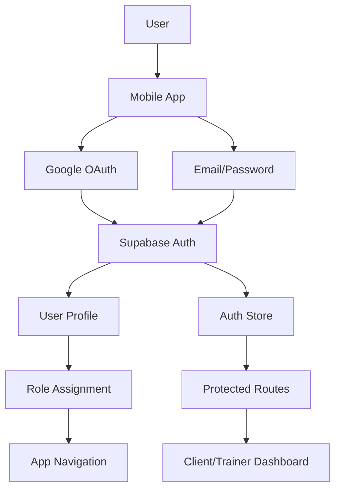
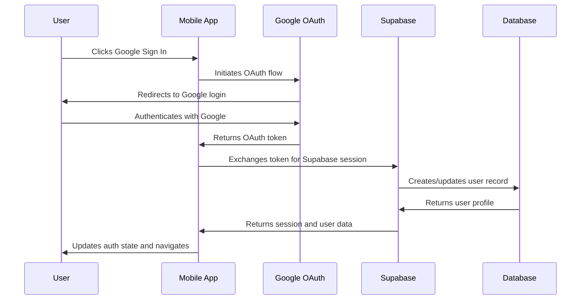
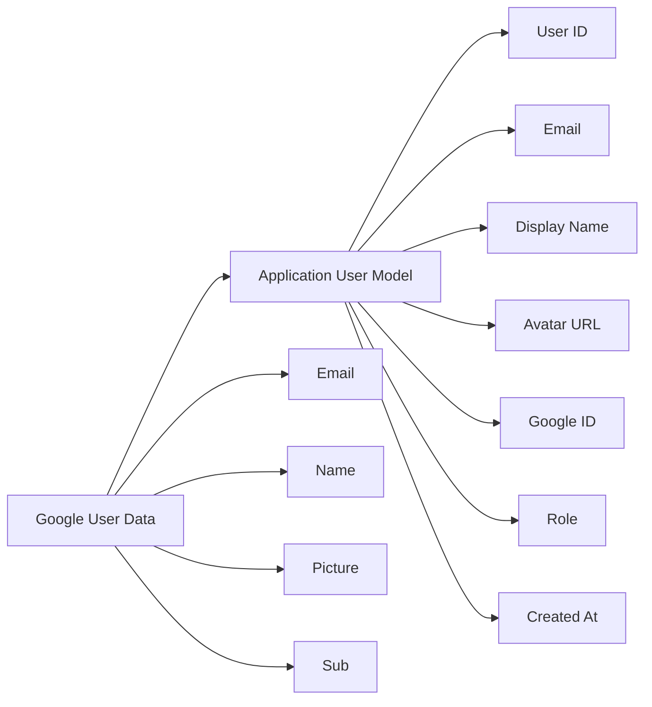

# Google Sign In & Sign Up Implementation Plan with Supabase

## Overview
This plan outlines the implementation of Google OAuth authentication for the ZiroFit mobile application using Supabase as the authentication backend.

## Current Authentication Architecture
- **Framework**: React Native with Expo Router
- **Auth Provider**: Supabase
- **State Management**: Zustand with persistence
- **Current Methods**: Email/Password only
- **User Roles**: Client, Trainer

## Architecture Diagram

## Implementation Strategy

### Phase 1: Backend Configuration
1. **Research Supabase Google OAuth configuration requirements**
   - Review Supabase documentation for Google OAuth setup
   - Identify required Google Cloud Console configuration
   - Understand OAuth scopes needed for user data access

2. **Configure Google OAuth provider in Supabase dashboard**
   - Enable Google provider in Supabase Auth settings
   - Configure redirect URLs and OAuth scopes
   - Test OAuth flow in development environment

3. **Update environment variables with Google OAuth configuration**
   - Add Google OAuth client ID to environment variables
   - Update Supabase configuration if needed
   - Ensure proper environment variable handling

### Phase 2: Frontend Implementation
4. **Install required dependencies for Google Sign In (if needed)**
   - Check if additional packages are required for Google OAuth
   - Install and configure any necessary dependencies
   - Verify compatibility with existing React Native setup

5. **Create Google Sign In service/utility functions**
   - Implement Google OAuth authentication functions
   - Create utility functions for Google user data handling
   - Add error handling and logging

6. **Update login screen to include Google Sign In option**
   - Add Google Sign In button to existing login screen
   - Implement Google authentication flow
   - Handle Google user session creation

7. **Update register screen to include Google Sign Up option**
   - Add Google Sign Up button to existing register screen
   - Implement role selection for Google users
   - Handle Google user profile creation

### Phase 3: Integration & Enhancement
8. **Handle Google OAuth callback and session management**
   - Implement OAuth callback handling
   - Ensure proper session management for Google users
   - Handle token refresh and expiration

9. **Update authentication flow to handle Google users**
   - Modify auth store to support Google OAuth users
   - Update authentication state management
   - Ensure proper user data persistence

10. **Update error handling for Google authentication**
    - Add specific error handling for Google OAuth errors
    - Implement user-friendly error messages
    - Handle network and API errors gracefully

11. **Add loading states for Google authentication**
    - Implement loading indicators for Google authentication
    - Add proper loading state management
    - Ensure smooth user experience during authentication

12. **Implement user profile creation/update for Google users**
    - Create user profiles for Google OAuth users
    - Map Google user data to application user model
    - Handle profile updates and synchronization

13. **Update role selection for Google sign up flow**
    - Implement role selection for Google sign up
    - Store role information in user profile
    - Ensure proper role-based routing

14. **Ensure proper user data mapping from Google OAuth**
    - Map Google user data fields to application user model
    - Handle missing or optional fields gracefully
    - Ensure data consistency and validation

### Phase 4: Testing & Validation
15. **Test Google Sign In/Sign Up flow end-to-end**
    - Test complete authentication flow
    - Verify user creation and profile setup
    - Test role assignment and routing

16. **Test authentication state persistence with Google users**
    - Test session persistence across app restarts
    - Verify token refresh functionality
    - Test logout and session cleanup

17. **Verify redirect flow works correctly with Google authentication**
    - Test proper routing after authentication
    - Verify redirect to appropriate dashboard
    - Test navigation between authenticated and unauthenticated states

18. **Add Google user data to auth store**
    - Update auth store to handle Google user data
    - Ensure proper state management for Google users
    - Add user data synchronization

19. **Update user profile fetching for Google authenticated users**
    - Implement profile fetching for Google users
    - Handle profile data synchronization
    - Ensure profile data consistency

## Technical Implementation Details

### Google OAuth Flow

### User Data Mapping

### Error Handling Strategy
- **Network Errors**: Retry mechanism with exponential backoff
- **OAuth Errors**: Clear error messages with recovery options
- **Session Errors**: Automatic token refresh with fallback
- **Profile Errors**: Graceful degradation with retry logic

## Security Considerations
- OAuth token validation and refresh
- Secure storage of authentication tokens
- HTTPS enforcement for all API calls
- Input validation and sanitization
- Rate limiting and abuse prevention

## Performance Considerations
- Optimized loading states and animations
- Efficient user data caching
- Minimal API calls with proper batching
- Background sync for user data
- Proper memory management

## Testing Strategy
- Unit tests for authentication functions
- Integration tests for OAuth flow
- End-to-end tests for complete authentication
- Error scenario testing
- Performance testing for authentication flow

## Success Metrics
- Successful Google OAuth authentication rate
- User conversion from email to Google authentication
- Authentication flow completion time
- Error rate reduction
- User satisfaction improvement